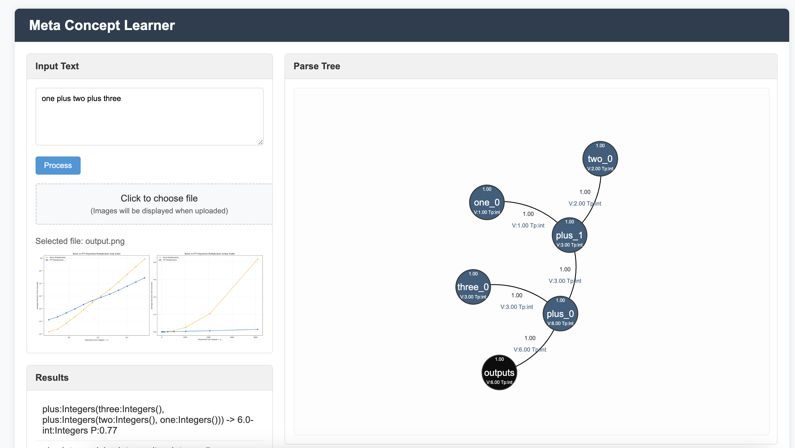

## Meta Concept Learner
Efficient continual learning of new concept and flexible representation using natural supervision.

## Prerequisites
this section is about the prerequisites

## Dataset preparation
this section is about the dataset generation.
we can find the scripts to generate the data used for our experiment under the directory of 
`scripts/data_gen/...`

## Training and evaluation
this section is about training and testing of the model.

Fun Fun Fun
https://sites.google.com/view/virtualtoolsgame