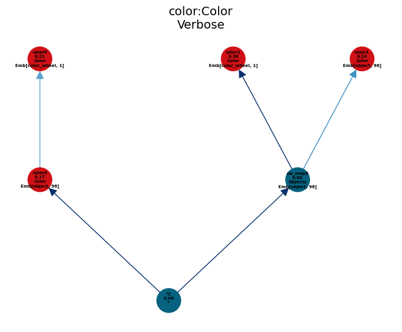

## Meta Concept Learner
Efficient continual learning of new concept and flexible representation using natural supervision.


## Prerequisites
this section is about the prerequisites

```
conda create -n prototype anaconda
conda install pytorch torchvision -c pytorch
```

## Dataset preparation
this section is about the dataset generation.
we can find the scripts to generate the data used for our experiment under the directory of 
`scripts/data_gen/...`


## Training and evaluation
this section is about training and testing of the model.

## Commands for the Model
All the model checkpoints are saved under the directory `outputs/checkpoints`. A model checkpoint with $\texttt{name}$ will have a folder of same name under the previous directory. This stores the the domain learneable parameters under the `domains` directory and reductions under the `frames` directory.
```
Model
├── config.yaml
├── core_vocab.txt
├── lexicon_entries.pth
├── lexicon_weights.pth
|
├── domains
│   ├── Color.pth
│   ├── Order.pth
│   ├── Scene.pth
|   └── Integer.pth
|
└── frames
    ├── images
    ├── questions.json
    ├── scenes-raw.json
    └── vocab.json
```
### Dataset and environment config
dataset and  environment configs are saved under the `configs/dataset_config.yaml` and `configs/env_config.yaml`. In the dataset config it stored the name of the dataset and path of to load this dataset and the corresponding $\texttt{getter()}$ method

### Create blank MetaLearner
`scripts/grounding/create_prototype.sh` this will create the prototype MetaLearner using the vocab and domain config under the `data/core_vocab.txt` and `configs/core_domains.yaml`. This command will load the vocabulary and domains specified in the  $\texttt{core-domains.yaml}$  then 

### Learn vocabulary-domain association
scripts under the dir `scripts/` will load the specified model

Fun Fun Fun
https://sites.google.com/view/virtualtoolsgame

## Framework Details

### CCG Based Parser
In this work we use the categorical-combinatoric-grammar to perform the parsing the model [G2L2](https://proceedings.neurips.cc/paper_files/paper/2021/file/4158f6d19559955bae372bb00f6204e4-Paper.pdf).

### Evaluation Model

### Update Model
add minimal amount of edges to cover

## Experiment Results


learned object to color mapping structure



### Related Works
**Neuro-Symbolic Concept Learner**

[NS-CL](https://arxiv.org/pdf/1904.12584) The Neuro-Symbolic Concept Learner: Interpreting Scenes, Words and Sentences from Natural Supervision : the inital work of neuro-symbolic concept learner, joint learning with natural supervision 

[G2L2](https://proceedings.neurips.cc/paper_files/paper/2021/file/4158f6d19559955bae372bb00f6204e4-Paper.pdf) : associate word with CCG lexicon entries with natural supervision 

[FALCON](https://arxiv.org/pdf/2203.16639) : fast visual concept learning by integrating images, linguistic descriptions and conceptual relations. It provides a meta-learning framework that can fast learning new visual concepts with just one or few examples guided by mulitple naturally occuring data streams.

[Mechanisms](https://arxiv.org/pdf/2311.03293): Learining Reusable Planning Stratagies. A specific strategy is specified by the contact mode. Parameters of each stratagey is grounded by self-replay.

[DCL](https://arxiv.org/pdf/2103.16564) Grounded Physical Concepts of Objects and Events Through Dynamic Visual Reasoning: learning to ground visual concepts and dynamic concepts. This framework provides a useful DSL for the learining of dyanmic concepts.


